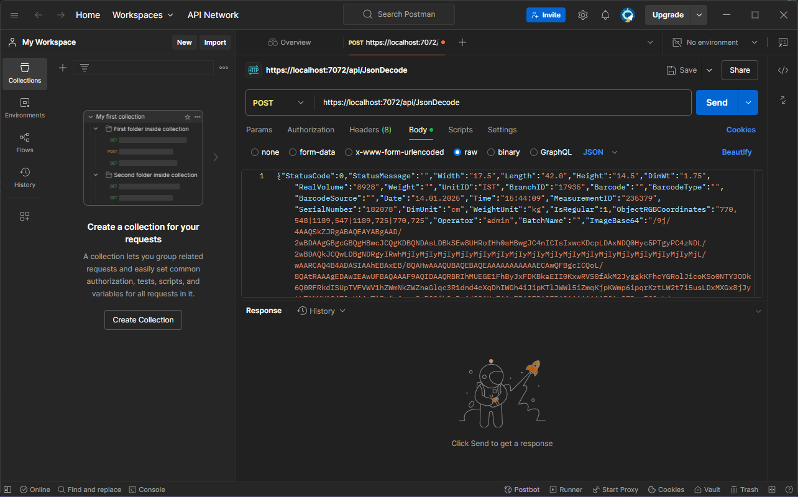
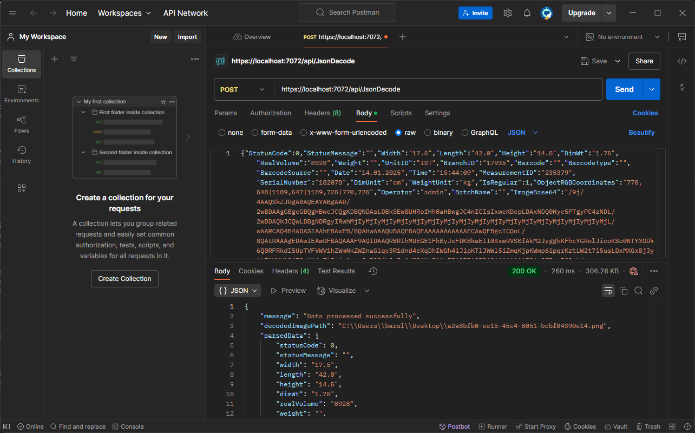
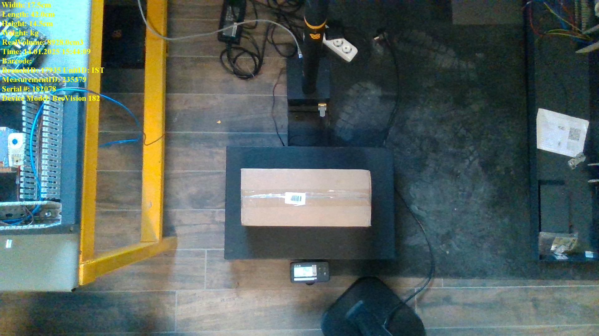
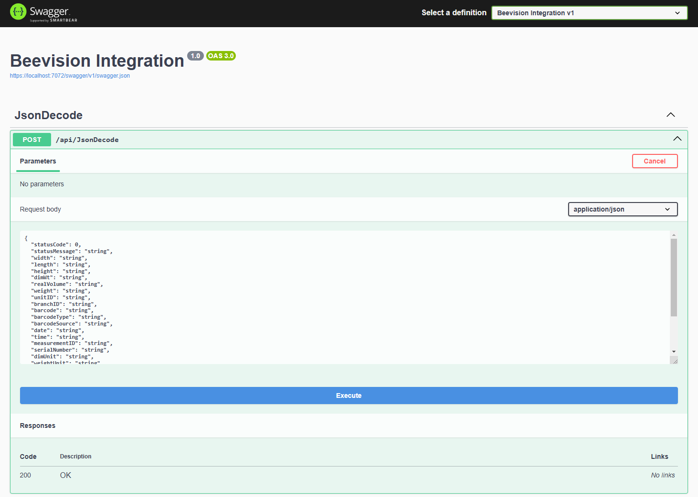
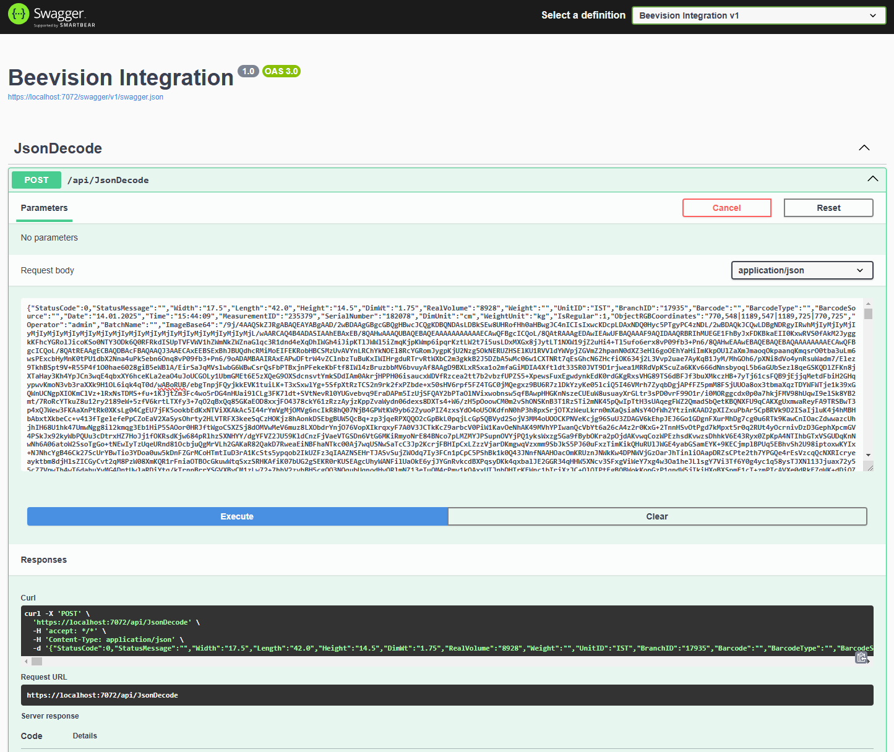
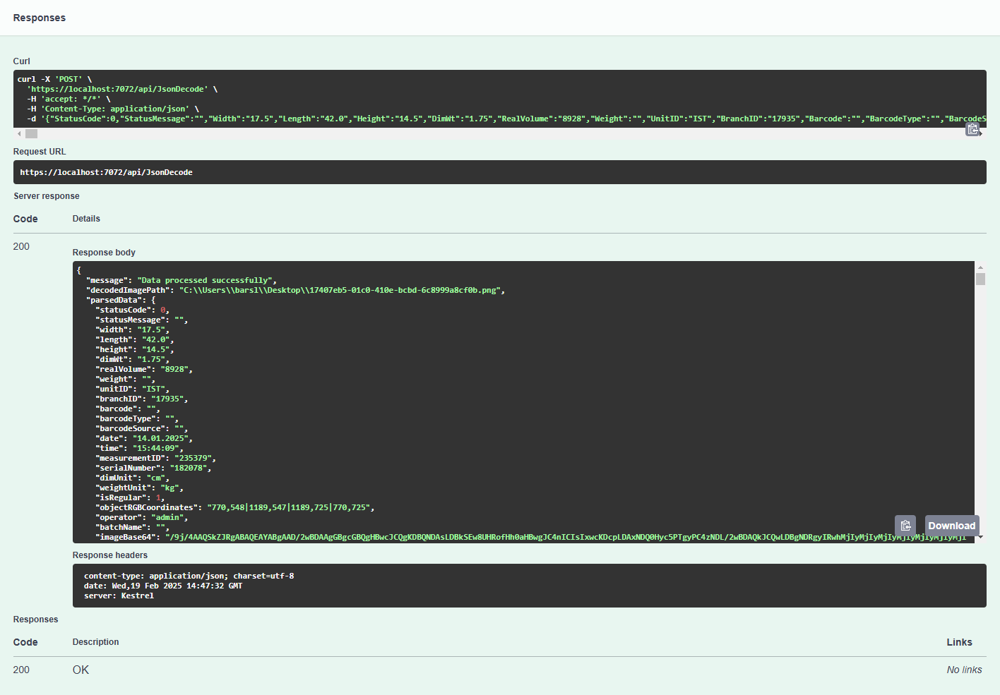

# API Image Decoder Project

## Project Description
This project is a C# application designed to interact with an API, parse incoming JSON data, decode a base64-encoded image string, and generate an image file on the desktop.

## Features
- Send requests to an API endpoint.
- Parse JSON response data.
- Decode base64-encoded image data from the JSON response.
- Save the decoded image as a file on the user's desktop.

## Technologies Used
- C#
- .NET Framework / .NET Core
- Visual Studio
- RestSharp (Optional, for API requests)

## Dependencies
This project relies on the following NuGet packages:

- Newtonsoft.Json – JSON data parsing.
- RestSharp (Optional) – Sending HTTP requests to APIs.

Installing Dependencies:
- Open Visual Studio.
- Go to Tools > NuGet Package Manager > Manage NuGet Packages for Solution.
- Search for Newtonsoft.Json and RestSharp.
- Click Install to add them to your project.

## Getting Started

### Prerequisites
- Visual Studio 2022 or later
- .NET Framework or .NET Core installed
- Postman (for testing API requests)
- Swagger documentation (if provided by API provider)

### Installation
1. Clone the repository or download the project files.
2. Open the solution file (.sln) in Visual Studio.
3. Restore NuGet packages if needed.
4. Build the solution.

## Usage

### 1. Sending JSON to API with Postman
- Open Postman.
- Set the HTTP method to POST.
- Enter the API endpoint URL.
- In the `Body` tab, select `raw` and set the content type to `JSON`.
- Input the JSON data, for example:

```json
{
  "imageData": "<base64EncodedImageString>",
  "otherData": "exampleValue"
}
```

Below is an example using of Postman before sending request:



- Click `Send`.
- The API should return a JSON response containing base64 image data or other details.

Below is an example using of Postman after sending request and gets response:



-You will see an example measurement image on your desktop.



### 2. Using Swagger
- Open the Swagger UI in your browser.
- Locate the relevant POST endpoint.
- Click `Try it out`.
- Input the JSON data in the provided text box.

Below is an example using of Swagger before sending request:



- Click `Execute` to send the request.



- Review the response data.



### 3. Parsing JSON and Decoding Base64 Image in C#
Sample code snippet:

```csharp
using System;
using System.IO;
using Newtonsoft.Json;
using System.Drawing;

class Program
{
    static void Main(string[] args)
    {
        string jsonResponse = "{\"imageData\": \"<base64StringHere>\"}";

        dynamic data = JsonConvert.DeserializeObject(jsonResponse);
        string base64Image = data.imageData;

        byte[] imageBytes = Convert.FromBase64String(base64Image);

        string imagePath = Path.Combine(Environment.GetFolderPath(Environment.SpecialFolder.Desktop), "decodedImage.png");

        File.WriteAllBytes(imagePath, imageBytes);

        Console.WriteLine($"Image saved to: {imagePath}");
    }
}
```

## Testing
- Use Postman or Swagger to send test JSON payloads to the API.
- Verify that the base64 image string is correctly decoded and saved as an image on the desktop.

## Troubleshooting
- Ensure that the base64 string is valid.
- Check for any null values in the JSON response.
- Confirm file write permissions on the desktop.

## License
This project is licensed under the MIT License.

## Contact
For any inquiries, please contact Berkay Arslan at berkayarslan@beevision.ai

